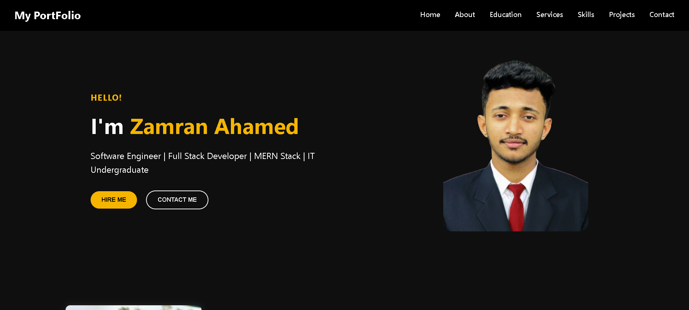
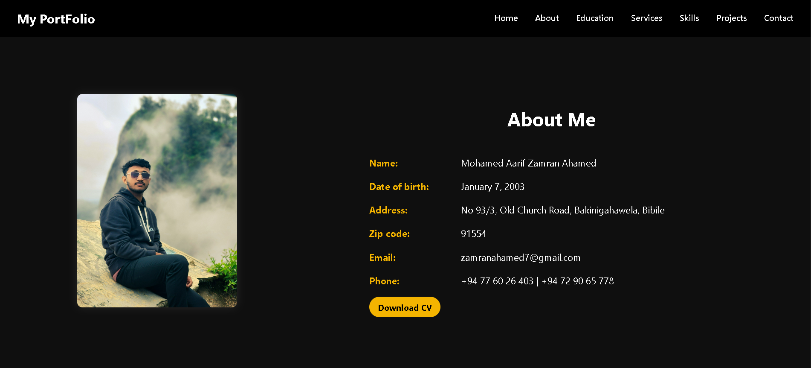

# 💼 My-Portfolio

A clean and responsive **personal portfolio website** developed using **HTML, CSS, and JavaScript**. This project showcases all the academic, personal activities, and contact information of **Zamran Ahamed** in a structured and elegant manner.

---

## 📌 Description

This portfolio serves as a digital resume for Zamran Ahamed, highlighting:

- Personal background
- Educational qualifications
- Skills and services
- Projects
- Contact details

Built from scratch using only HTML, CSS, and vanilla JS — no frameworks used!

---

## ✨ Features

- 🧑‍💼 Introduction section with image and title
- 📚 Educational background
- 🛠️ Skills and services
- 💼 Projects section
- 📞 Contact section with downloadable CV
- 📱 Fully responsive layout

---

## 🛠️ Tech Stack

- **HTML5**
- **CSS3**
- **JavaScript (Vanilla)**

---

## 🖼️ Screenshots

| Landing Page | About Me Section |
|--------------|------------------|
|  |  |

---

## 🚀 How to Run Locally

1. Open the project folder in **Visual Studio Code** or any preferred editor.
2. Open `index.html` with **Live Server** or in your browser.
3. That's it — no installation required!

---

## 👨‍💻 Author

- **Zamran Ahamed**
- GitHub: [@ZamranAhamed](https://github.com/ZamranAhamed)
- Email: zamranahamed7@gmail.com
